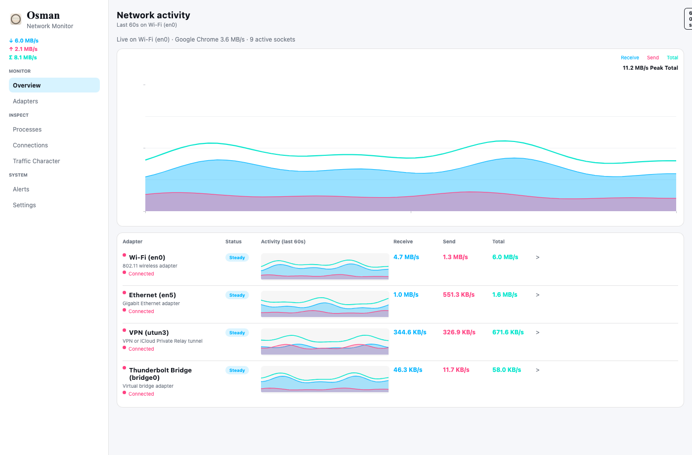
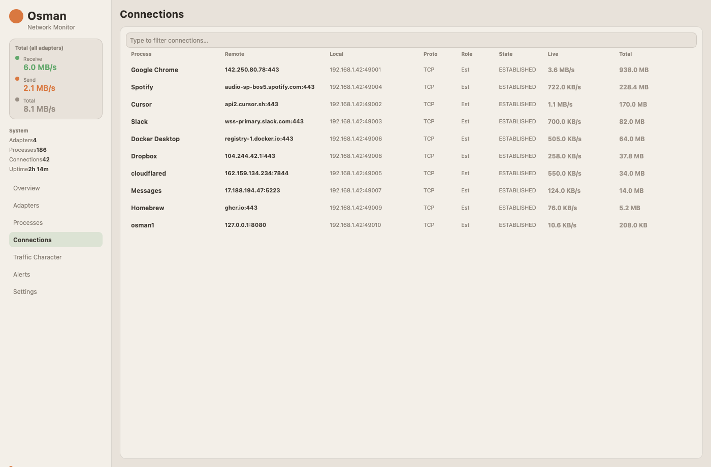
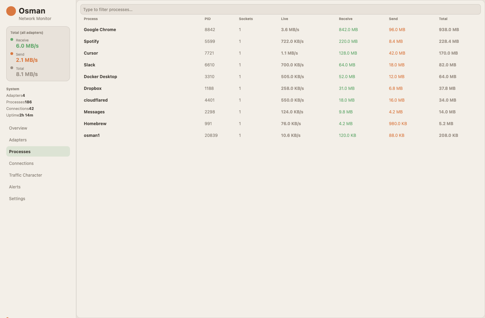
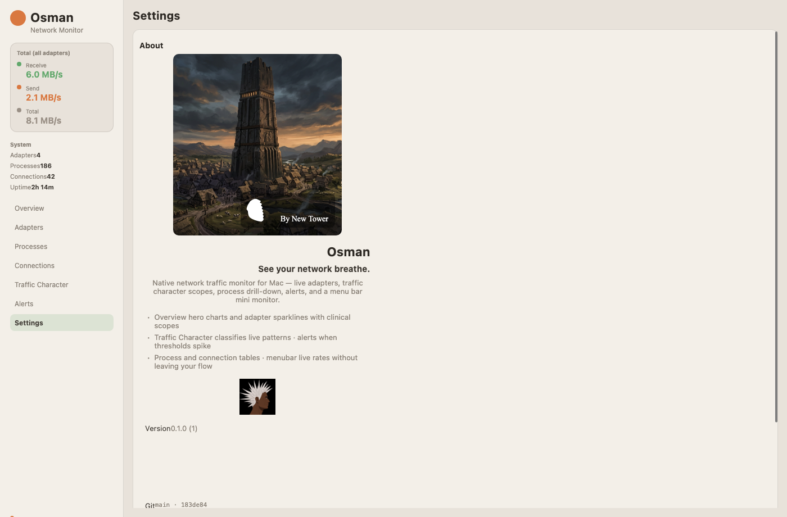
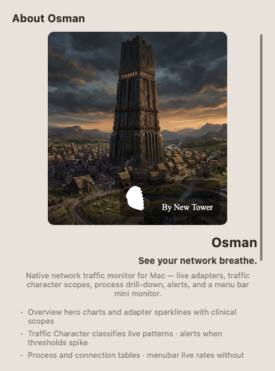
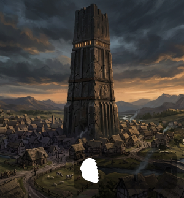
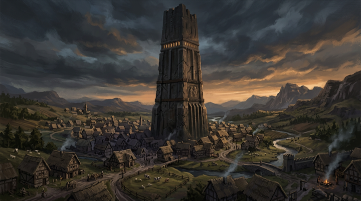

# Osman by New Tower

> **Work in progress** — early native macOS network monitor built with Rust + [Freya](https://freyaui.dev). UI, menubar integration, and About branding are actively being shaped; expect rough edges.

**Osman** is a colorful live traffic monitor: adapters, processes, connections, traffic character scopes, alerts, and a menu-bar mini monitor — all without root or packet capture (OS interface counters via `sysinfo`).

---

## Screenshots (mock traffic demo)

Headless Freya renders of the live UI at 1400×920, using **`app_demo()`** with realistic mock adapters, hero chart history, processes, and connections (Chrome, Cursor, Slack, etc.).

### Overview



### Connections



### Processes



### Settings (embedded About)



### About window



Regenerate after UI changes:

```bash
./scripts/export-readme-screenshots.sh
```

---

## About branding (art assets)

| Splash card (Skia canvas) | Brand mark |
|---|---|
|  |  |

Tower Village source (Mohawk parity):



---

## What exists today

| Area | Status |
|------|--------|
| **Overview** | Hero network chart, adapter table, sparklines |
| **Adapters / Processes / Connections** | Live tables, drill-down detail views |
| **Traffic Character** | Pattern scopes + timeline (in progress) |
| **Alerts** | Threshold engine + rules UI |
| **Menu bar** | Live RX/TX rates, tray popover, About / Quit |
| **About** | New Tower splash, lockup, brand mark; macOS App menu redirect |
| **Onboarding** | First-run privacy sheet (what Osman reads / does not do); skipped after dismiss |
| **Theme** | Light clinical palette (taupe / sage / orange) |
| **Tests** | 73 unit + UI + pixel regression tests (`cargo test`) |

---

## Recent focus (Aug 2026)

1. **About panel** — Replaced macOS generic blue-folder About with a Freya window using embedded Mohawk-parity PNGs.
2. **macOS App menu hook** — `Osman → About` posts through Freya’s renderer dispatch (fixes prior panic outside component scope).
3. **Regression tests** — Off-screen Skia pixel checks + headless UI screenshot export for README.

---

## Run locally

```bash
cargo run
```

First compile pulls Freya/Skia and can take several minutes.

```bash
cargo test          # full suite
cargo test about    # About + branding tests only
```

---

## Stack

- **GUI:** Freya 0.4 (Skia, winit, tray)
- **Traffic:** `sysinfo` network counters, `lsof` / nettop parsing for connections
- **Polling:** `async-io` timer (~1 Hz snapshot loop)
- **macOS menu:** `objc2` App menu About redirect

---

## Roadmap (in progress)

See **[ROADMAP.md](ROADMAP.md)** for phased execution plan (Phase 0 → Pro).

- [ ] Polish Traffic Character scopes and transitions
- [ ] Connection detail chart axis labels / scale tuning
- [ ] App icon + dock tile (New Tower shell branding)
- [ ] Release build + notarization path
- [ ] Mohawk feature parity checklist

---

Designed and developed in Bellevue, WA by Jon McMillion for **New Tower**.
