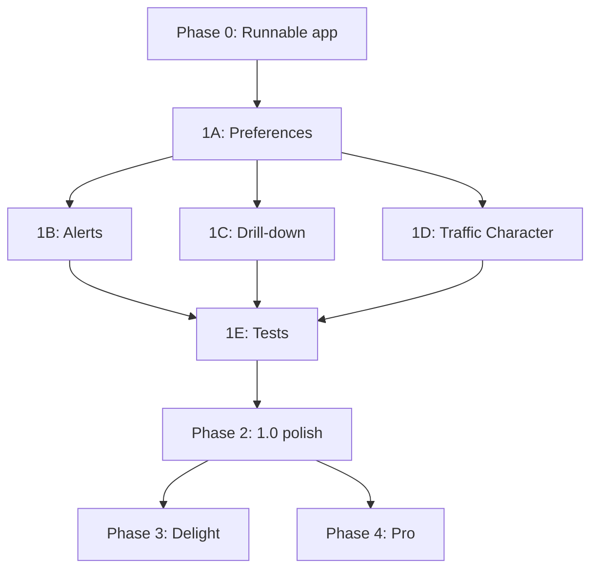

# Osman Roadmap — Phased Plan

> **Work in progress** · macOS network monitor · New Tower  
> Monitor only — no firewall, no root, no packet capture.

**Version today:** `0.1.0` · **Tests:** ~78 · **Stack:** Rust + Freya 0.4

This document is the **execution plan**. Check boxes in PRs; update status when a phase completes.

---

## Phase map (high level)

```
Phase 0 ──► Runnable app          (icon, release, errors, onboarding)
    │
Phase 1 ──► Private beta          (settings, alerts, drill-down, live Traffic Character)
    │
Phase 2 ──► Public 1.0            (performance, polish, docs)
    │
Phase 3 ──► Differentiators       (delight features, Mohawk tie-in)
    │
Phase 4 ──► Osman Pro (optional)  (history export, GeoIP, webhooks)
```

| Phase | Goal | Target | Depends on |
|-------|------|--------|------------|
| **0** | Someone can download & run it | ~1–2 weeks | — |
| **1** | Daily-driver beta | ~3–4 weeks | Phase 0 |
| **2** | Public 1.0 quality | ~2 weeks | Phase 1 |
| **3** | Stand-out product | ongoing | Phase 2 |
| **4** | Monetization layer | TBD | Phase 2+ |

---

## Current architecture (reference)

```
┌─────────────┐   ┌─────────────┐   ┌──────────────┐
│ sysinfo     │   │ nettop      │   │ lsof         │
│ (adapters)  │   │ (tcp/udp)   │   │ (listeners)  │
└──────┬──────┘   └──────┬──────┘   └──────┬───────┘
       │                 │                  │
       └────────────┬────┴──────────────────┘
                    ▼  1 Hz (POLL_INTERVAL)
            NetworkSnapshot + TrafficSnapshot
                    │
       ┌────────────┼────────────┬──────────────┐
       ▼            ▼            ▼              ▼
   Overview    Connections   Alerts      Menubar tray
   Adapters    Processes     Traffic Character
```

**Key files:** `main.rs` · `network.rs` · `detail.rs` · `parse.rs` · `charts.rs` · `alerts.rs` · `menubar.rs` · `traffic_character*.rs` · `connection_detail_view.rs`

---

# Phase 0 — Runnable app

**Outcome:** Gatekeeper-trusted `.app` or DMG. User sees traffic **or** a clear fix-it message — never a silent empty UI.

### 0.1 — Brand & bundle identity ✅

| # | Task | Files / notes | Effort |
|---|------|---------------|--------|
| 0.1a | ✅ Clinical Scope app icon (mock 04) | `resources/icon/OsmanAppIcon-1024.png`, `AppIcon.appiconset` | M |
| 0.1b | ✅ Wire icon into Freya/winit + `.icns` | `icon_assets.rs`, `build.rs`, `WindowConfig::with_icon` | S |
| 0.1c | ✅ Branded menubar tray icon | `MenubarIcon-22.png` replaces programmatic dots | S |
| 0.1d | ✅ Bundle ID, display name, copyright | `resources/Info.plist`, `scripts/build-release.sh` | S |

**Design:** [`docs/design/phase-0.1-clinical-icon.md`](docs/design/phase-0.1-clinical-icon.md)

**Acceptance:** Dock and About show branded icon; menubar icon is recognizable at 22×22.

---

### 0.2 — Release build pipeline ✅

| # | Task | Files / notes | Effort |
|---|------|---------------|--------|
| 0.2a | ✅ `scripts/build-release.sh` | `dist/Osman.app` + clinical icon | M |
| 0.2b | Embed version + git metadata in About | `build.rs` (exists) | S |
| 0.2c | ✅ Release profile tuning | `Cargo.toml` lto + strip | S |
| 0.2d | Smoke test: release binary launches | Manual / `./scripts/build-dmg.sh` | S |

**DMG:** `./scripts/build-dmg.sh` → `dist/Osman-0.1.0.dmg`

**Acceptance:** `./scripts/build-release.sh` produces `Osman.app` that runs without debug deps.

---

### 0.3 — Notarization & distribution

| # | Task | Files / notes | Effort |
|---|------|---------------|--------|
| 0.3a | Apple Developer ID signing | Xcode / `codesign` documented in script | M |
| 0.3b | Notarize + staple | `xcrun notarytool`, `stapler staple` | M |
| 0.3c | DMG layout (drag to Applications) | `create-dmg` or `hdiutil` script | S |
| 0.3d | GitHub Release workflow (optional) | `.github/workflows/release.yml` upload DMG | M |

**Acceptance:** Fresh Mac downloads DMG, opens app without "unidentified developer" after notarization.

---

### 0.4 — Empty-data & error UX ✅

| # | Task | Files / notes | Effort |
|---|------|---------------|--------|
| 0.4a | ✅ Detect nettop/lsof failure (exit code, empty parse) | `detail.rs` + `data_health.rs` | M |
| 0.4b | ✅ Surface status in Overview adapter table | `overview_ui.rs` — reason-specific copy | S |
| 0.4c | ✅ Banner when subprocess tools missing | `overview_health_banner()` on Overview | S |
| 0.4d | Log collection errors (stderr) for support | `eprintln!` or tiny log file in Application Support | S |

**Design:** [`docs/design/phase-0.4-data-health.md`](docs/design/phase-0.4-data-health.md)

**Copy examples:**
- Adapters empty → "No active interfaces (loopback hidden)."
- nettop failed → "Could not run `nettop`. Install Xcode CLT: `xcode-select --install`."
- lsof failed → "Connection list unavailable; adapter totals still work."

**Acceptance:** Kill `nettop` path → user sees banner, not blank charts forever.

---

### 0.5 — Onboarding & privacy ✅

| # | Task | Files / notes | Effort |
|---|------|---------------|--------|
| 0.5a | ✅ First-run sheet (1 screen) | `onboarding.rs` — reads / does-not copy | M |
| 0.5b | ✅ Link to Settings / About from sheet | Settings nav + `request_about_window()` | S |
| 0.5c | ✅ Store `has_seen_onboarding` flag | `~/Library/Application Support/Osman/onboarding_done` | S |

**Design:** [`docs/design/phase-0.5-onboarding.md`](docs/design/phase-0.5-onboarding.md)

**Acceptance:** First launch shows onboarding; second launch skips it.

---

### Phase 0 exit checklist

- [x] Branded `.app` + DMG
- [ ] Notarized (or documented skip for internal-only)
- [x] Error states for failed data collection
- [x] Onboarding screen
- [ ] README install section updated

---

# Phase 1 — Private beta

**Outcome:** You can use Osman daily for a week. Settings stick across restarts. Alerts and drill-downs feel real.

**Recommended order:** 1A → 1B → 1C → 1D → 1E (persistence first — other features save into it).

---

## Phase 1A — Settings & persistence

### 1A.1 — Preferences model

| # | Task | Files | Effort |
|---|------|-------|--------|
| 1A.1a | New `src/preferences.rs` — struct + JSON serde | `Preferences { poll_ms, default_section, menubar_only, onboarding_done, … }` | M |
| 1A.1b | Load/save `~/Library/Application Support/Osman/preferences.json` | Create dir on first run | M |
| 1A.1c | Load prefs at launch in `main()` before `launch()` | `main.rs` | S |
| 1A.1d | Tests: round-trip serialize, missing file defaults | `preferences.rs` | S |

### 1A.2 — Settings UI (split About out)

| # | Task | Files | Effort |
|---|------|-------|--------|
| 1A.2a | Settings sections: General · Alerts · About | `main.rs` → refactor `settings_panel` | M |
| 1A.2b | General: poll interval (0.5s / 1s / 2s) | Wire to `POLL_INTERVAL` or runtime override | M |
| 1A.2c | General: default sidebar section on launch | `app_section` initial state from prefs | S |
| 1A.2d | General: launch at login toggle | `SMLoginItemSetEnabled` or `launchd` helper — research spike | L |
| 1A.2e | General: menubar-only (hide dock) | `NSApplicationActivationPolicyAccessory` via objc2 | M |
| 1A.2f | Move About to own window only + slim Settings About link | Keep tray/menu About; Settings shows version row | S |

**Acceptance:** Change poll interval → persists after quit. About still works from App menu.

---

## Phase 1B — Alerts (make rules real)

### 1B.1 — Interactive rules

| # | Task | Files | Effort |
|---|------|-------|--------|
| 1B.1a | Click rule row → `AlertEngine::toggle_rule(id)` | `alerts.rs` → `alert_rule_row` | S |
| 1B.1b | Visual enabled/disabled state (opacity, checkmark) | `alerts.rs` | S |
| 1B.1c | Persist rules in `preferences.json` | `AlertRule` serde in prefs | M |
| 1B.1d | Settings → Alerts sub-panel lists same rules | Share component with Alerts screen | S |

### 1B.2 — Editable thresholds

| # | Task | Files | Effort |
|---|------|-------|--------|
| 1B.2a | `AlertEngine::update_rule(id, threshold, sustained_secs)` | `alerts.rs` | S |
| 1B.2b | Inline edit UI (click threshold → text field) or simple stepper | Freya input in rule row | M |
| 1B.2c | Use `Critical` severity for fan-out / wildcard rules | `alerts.rs` evaluate paths | S |

### 1B.3 — Alert history UX

| # | Task | Files | Effort |
|---|------|-------|--------|
| 1B.3a | Timestamps formatted for display | `alert_event_row` | S |
| 1B.3b | Clear log button | Truncate `events` deque | S |
| 1B.3c | Sidebar badge count (already partial) — verify accuracy | `sidebar_status_footer` | S |

**Acceptance:** Disable "Total bandwidth spike" → no events for rule 1. Threshold change survives restart.

---

## Phase 1C — Drill-down & filters

### 1C.1 — Process detail screen

| # | Task | Files | Effort |
|---|------|-------|--------|
| 1C.1a | New `src/process_detail_view.rs` (mirror connection detail) | Hero chart for process aggregate rates | L |
| 1C.1b | Make `process_row` clickable → `selected_process: State<Option<u32>>` | `main.rs` | M |
| 1C.1c | Filter connections table by PID in detail view | Reuse `ConnectionDetail` list | M |
| 1C.1d | Back navigation + breadcrumb | Match `connection_detail_view` pattern | S |
| 1C.1e | Tests: click process → detail title shows process name | `freya-testing` | M |

### 1C.2 — Working search filters

| # | Task | Files | Effort |
|---|------|-------|--------|
| 1C.2a | Replace `list_filter_bar` hint with Freya `TextInput` | `main.rs` | M |
| 1C.2b | Filter processes by name substring | `processes_list_view` | S |
| 1C.2c | Filter connections by process / remote / port | `connections_list_view` | S |
| 1C.2d | Persist last filter per section in prefs | `preferences.rs` | S |

**Acceptance:** Click Chrome in Processes → see only Chrome sockets. Type "443" in Connections → filters list.

---

## Phase 1D — Traffic Character (live, honest)

### 1D.1 — Remove demo ambiguity

| # | Task | Files | Effort |
|---|------|-------|--------|
| 1D.1a | Remove or rewrite "demo waveforms" legend | `traffic_character_view.rs:71` | S |
| 1D.1b | Drive scope waveforms from `RateTracker` / connection history | `character_render.rs`, wire live data | L |
| 1D.1c | Classify from `traffic_character.rs::detect_character` — show label per adapter | Already partially wired | M |
| 1D.1d | Timeline segments reflect class transitions | `character_timeline.rs` | M |

### 1D.2 — Connection detail charts (finish open work)

| # | Task | Files | Effort |
|---|------|-------|--------|
| 1D.2a | Y-axis labels on connection traffic chart | `connection_detail_view.rs` | M |
| 1D.2b | Sticky scale for connection hero | Reuse `ChartScaleBank` | S |
| 1D.2c | Pixel regression test for connection chart | `chart_test_harness.rs` | S |

**Acceptance:** Traffic Character scopes visibly react when you run a speed test. No "demo" disclaimer in production UI.

---

## Phase 1E — Beta quality & tests

| # | Task | Files | Effort |
|---|------|-------|--------|
| 1E.1 | Fixture files: sample nettop + lsof output | `tests/fixtures/` | S |
| 1E.2 | Integration test: fixtures → `TrafficSnapshot` | `detail.rs` test module | M |
| 1E.3 | Adapter friendly names via SCNetwork API or heuristic table | `adapters.rs` — stop hardcoding en0=Wi-Fi | M |
| 1E.4 | Beta feedback link in Settings (GitHub Issues / email) | `settings_panel` | S |

### Phase 1 exit checklist

- [ ] Preferences persist across restarts
- [ ] Alert rules toggle + edit + persist
- [ ] Process detail screen
- [ ] Text filters on Processes / Connections
- [ ] Traffic Character uses live data
- [ ] 65+ tests, integration fixture test green

---

# Phase 2 — Public 1.0

**Outcome:** Feels shippable to strangers. Performance acceptable on busy Macs.

| # | Work package | Details | Effort |
|---|--------------|---------|--------|
| 2.1 | **Poll performance** | Don't `refresh_processes(All)` every tick; cache PIDs; batch nettop calls | L |
| 2.2 | **Interface errors/drops** | Read from `getifaddrs` or sysinfo extensions; `detail.rs` `interface_hardware` | M |
| 2.3 | **Time window labels** | Adapter header reflects 60s / 5m / 15m | `overview_ui.rs` | S |
| 2.4 | **Menubar copy fix** | Tooltip: sage receive, orange send | `menubar.rs` | S |
| 2.5 | **Light-only decision doc** | Explicit "no dark mode in 1.0" in README or keep dark palette | S |
| 2.6 | **Docs pass** | README test count, ROADMAP checkboxes, Mohawk parity table | S |
| 2.7 | **Website / GitHub release notes** | Changelog from Phase 0–1 | M |

### Phase 2 exit checklist

- [ ] CPU use stable over 30 min on M1 Mac
- [ ] No misleading UI copy
- [ ] v1.0.0 tagged + release notes

---

# Phase 3 — Differentiators (post-1.0)

Pick **2–3** per quarter; not all required for 1.0.

| ID | Feature | What to build | Primary files |
|----|---------|---------------|---------------|
| 3.1 | **"Last 60s" narrative** | One-line summary under hero: "↑ send spike on en0 · 3 new connections" | `overview_ui.rs`, `alerts.rs` |
| 3.2 | **Adapter personality** | Badge: Steady / Bursty / Idle from consistency score | `network.rs`, `overview_ui.rs` |
| 3.3 | **Menubar sparkline polish** | Filled area in popover, match hero palette | `menubar.rs`, `charts.rs` |
| 3.4 | **Traffic Character marketing** | Dedicated screenshot mode + landing copy | `mock_traffic.rs`, README |
| 3.5 | **Mohawk cross-link** | "Open feed reader" / shared prefs namespace | new module, optional |
| 3.6 | **Export current view** | CSV of visible connections / processes | `detail.rs` export fn |

---

# Phase 4 — Osman Pro (monetization)

**Prerequisite:** Phase 2 shipped, small user base for feedback.

### 4.1 — Foundation (Pro infrastructure)

| # | Task | Effort |
|---|------|--------|
| 4.1a | License key or StoreKit 2 subscription stub | L |
| 4.1b | Feature flag `ProFeatures` in prefs | S |
| 4.1c | Pro badge in About / Settings | S |

### 4.2 — Pro feature set (v1)

| Feature | Implementation sketch | Effort |
|---------|----------------------|--------|
| **History export** | SQLite or CSV rollups beyond 900 samples | L |
| **GeoIP / ASN** | MaxMind lite DB lookup on `remote_host` | M |
| **Webhook alerts** | POST on `AlertEngine` fire | M |
| **Bandwidth budgets** | Per-process daily cap in `AlertEngine` | M |
| **VPN leak hint** | Traffic on physical iface while utun active | M |

### 4.3 — Explicitly later (not Pro v1)

- Connection blocking / firewall
- MDM / enterprise deployment
- Windows port

---

# Dependency graph



**Parallelizable after 1A:** 1B, 1C, 1D can proceed on separate branches.

---

# Suggested sprint plan (6 weeks)

| Week | Focus | Deliverables |
|------|-------|--------------|
| **1** | Phase 0.1–0.2 | Icon, release script, branded menubar |
| **2** | Phase 0.3–0.5 | DMG, notarize, error UX, onboarding |
| **3** | Phase 1A | `preferences.rs`, Settings General panel |
| **4** | Phase 1B + 1C.2 | Alert toggles + text filters |
| **5** | Phase 1C.1 + 1D | Process detail + live Traffic Character |
| **6** | Phase 1E + 2.1 | Fixture tests, performance pass, v1.0.0 candidate |

Adjust pace as needed — weeks are relative, not calendar commitments.

---

# Task sizing key

| Size | Meaning |
|------|---------|
| **S** | ≤ half day |
| **M** | 1–2 days |
| **L** | 3–5 days |

---

# Non-goals (unchanged)

- Packet capture / DPI
- Kernel extension / firewall / block rules
- Non-macOS ports without alternative collectors
- Replacing iStat Menus or Little Snitch entirely

---

# Commands

```bash
cargo run                                          # dev
cargo test                                         # full suite
cargo test about                                   # branding
./scripts/export-readme-screenshots.sh             # mock traffic PNGs
# Phase 0: ./scripts/build-release.sh              # (to be added)
```

---

*Last updated: Aug 2026 · New Tower · Bellevue, WA*
